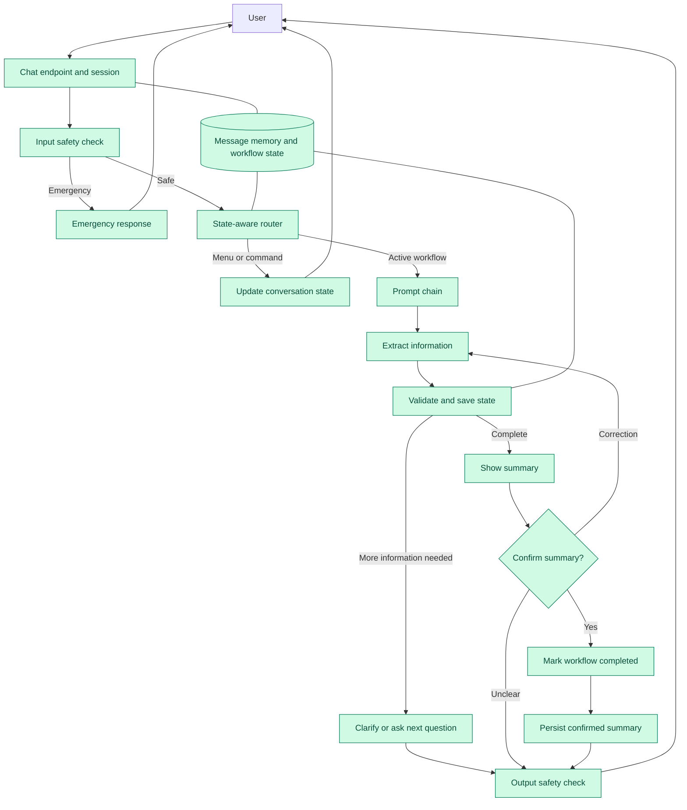

# Healthcare Chatbot Prompt-Chaining Architecture

This document is the living architecture diagram and implementation tracker for the healthcare chatbot's prompt chain. It must be updated whenever a prompt-chaining implementation step changes the runtime flow.

Last updated: 2026-07-26, after Step 12 — Direct Intent Classification

## Architecture diagram



### Diagram status legend

- Green: implemented and connected to the runtime flow.

## Current runtime flow

The application currently performs the following sequence:

```text
Request
  -> typed session lookup
  -> input moderation and emergency detection
  -> state-aware routing
      -> handled menu/global command: update state and return static response
      -> unhandled menu message: call the model intent classifier directly
      -> active workflow answer: run typed field extractor
  -> deterministically validate allowed fields and formats
  -> merge only accepted values into VisitData
  -> recalculate missing required fields
  -> add conditional missing fields for started address, insurance, and allergy sections
  -> return a clarification or next question when information is missing
  -> render a faithful summary from VisitData when collection is complete
  -> classify confirmation, correction, or unclear responses
  -> send corrections through extraction and validation again
  -> mark confirmed summaries completed without externally submitting them
  -> atomically persist confirmed summaries under UUID visit IDs
  -> use bounded extraction, validation, and confirmation fallbacks
  -> emit privacy-safe node telemetry without messages or patient values
  -> output moderation for collection responses
  -> save typed message memory and session state
```

The FastAPI runtime uses the typed prompt chain for every request. The legacy monolithic intake prompt, untyped compatibility adapter, JSON scraping, and free-form fallback have been removed. Confirmed summaries are stored locally as versioned JSON records and are never externally submitted by this workflow.

## Architecture patterns used

- State Machine Architecture
- Router–Worker Architecture
- Schema-Driven Collection
- Extract–Validate–Respond Pattern
- Looping or Iterative Collection Chain
- Conditional Branching Chains
- Structured Output Chaining
- Memory and State Separation
- Confirmation and Correction Chain
- Guardrail Chain
- Confidence-Based Routing
- Fallback and Recovery Chain

## Implementation tracker

| Step | Capability | Status | Primary implementation |
|---|---|---|---|
| 1 | Typed domain and workflow-state models | Complete | `src/models.py` |
| 2 | Typed session state and separate message memory | Complete | `src/app.py` |
| 3 | Workflow schemas and completeness rules | Complete | `src/workflow_schemas.py` |
| 4 | Versioned prompts for model-backed nodes | Complete; routing, validation, questions, summary, and output safety are deterministic | `src/prompts/`, `src/routing.py`, `src/questions.py`, `src/summary_workflow.py`, `src/moderation.py` |
| 5 | State-aware router and global commands | Complete | `src/routing.py`, `src/chatbot.py` |
| 6 | Structured extraction, validation, and safe merging | Complete | `src/extraction.py`, `src/models.py`, `src/chatbot.py` |
| 7 | Iterative questions and conditional branches | Complete | `src/questions.py`, `src/workflow_schemas.py`, `src/extraction.py` |
| 8 | Summary, confirmation, and corrections | Complete | `src/summary_workflow.py`, `src/chatbot.py` |
| 9 | Recovery, persistence, observability, and evaluation | Complete | `src/persistence.py`, `src/observability.py`, `src/evaluators/prompt_chain_evaluator.py` |
| 10 | Remove legacy fallback, untyped adapters, and unused prompt templates | Complete | `src/chatbot.py`, `src/app.py`, `src/prompts/` |
| 11 | Unify menu, intent, and workflow routing metadata | Complete | `src/workflow_catalog.py`, `src/routing.py`, `src/chatbot.py` |
| 12 | Route unhandled menu messages directly through the model intent classifier | Complete | `src/chatbot.py`, `src/workflow_catalog.py` |

## Documentation maintenance rule

For every future implementation step:

1. Update the Mermaid diagram to reflect newly connected nodes and removed compatibility paths.
2. Update the current runtime flow when orchestration changes.
3. Update the implementation tracker status and file references.
4. Update the `Last updated` line with the completed step and date.
