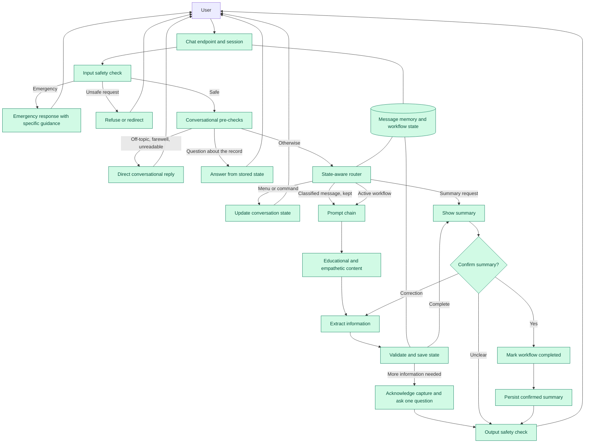

# Healthcare Chatbot Prompt-Chaining Architecture

This document is the living architecture diagram and implementation tracker for the healthcare chatbot's prompt chain. It must be updated whenever a prompt-chaining implementation step changes the runtime flow.

Roadmap note: this tracker covers the implemented prompt chain through the AI/API expansion work. The SRS now reserves Iteration 3 for the production RAG platform and Iteration 4 for the enterprise production platform.

Last updated: 2026-08-01, after Step 17 — benchmark-driven conversation quality and safety accuracy

## Architecture diagram



### Diagram status legend

- Green: implemented and connected to the runtime flow.

## Current runtime flow

The application currently performs the following sequence:

```text
Request
  -> typed session lookup
  -> input moderation
      -> active emergency: escalate with guidance specific to that emergency
      -> unsafe request: refuse, or decline the unsafe part and offer the safe one
      -> embedded instruction payload: strip it and process the remainder
  -> conversational pre-checks before any model call
      -> unreadable, non-English, off-topic, farewell, or unroutable message
      -> question about already-recorded state: answer from VisitData only
  -> state-aware routing
      -> handled menu/global command: update state and return static response
      -> summary workflow: render the record immediately, collecting nothing
      -> intent-classified message: start the workflow AND keep the message,
         which then continues into extraction below
      -> active workflow answer: run typed field extractor
  -> deterministically validate allowed fields and formats
  -> discard placeholder values the message never expressed
  -> merge accepted values into VisitData, accumulating list entries and
     treating a restated value as a correction
  -> recalculate missing required fields, clinical detail before administrative
  -> add conditional missing fields for started medication, allergy, insurance,
     and address sections
  -> compose the reply: greeting and empathy, any educational answer, what was
     recorded, then exactly one next question
  -> render a summary from VisitData when collection is complete, as prose for
     reading or as a schema-complete JSON document when one is requested
  -> classify confirmation, correction, or unclear responses
  -> send corrections through extraction and validation again
  -> mark confirmed summaries completed without externally submitting them
  -> atomically persist confirmed summaries under UUID visit IDs
  -> use bounded extraction, validation, and confirmation fallbacks
  -> emit privacy-safe node telemetry without messages or patient values
  -> output moderation, which ignores matches the surrounding text negates so
     the assistant's own refusals are not filtered as violations
  -> save typed message memory and session state
```

The FastAPI runtime uses the typed prompt chain for every request. The legacy monolithic intake prompt, untyped compatibility adapter, JSON scraping, and free-form fallback have been removed. Confirmed summaries are stored locally as versioned JSON records and are never externally submitted by this workflow.

## Architecture patterns used

- State Machine Architecture
- Router–Worker Architecture
- Schema-Driven Collection
- Extract–Validate–Respond Pattern
- Looping or Iterative Collection Chain
- Conditional Branching Chains
- Structured Output Chaining
- Memory and State Separation
- Confirmation and Correction Chain
- Guardrail Chain
- Confidence-Based Routing
- Fallback and Recovery Chain

## Design rules this chain holds to

These are the invariants the benchmark exists to protect. Each was added after a
measured failure, and each is enforced in code rather than by prompt wording.

1. **No user message is discarded.** Selecting a workflow and supplying its data
   are the same act. A message routed by the intent classifier continues into
   extraction; only a bare menu number, which carries nothing to extract, stops
   at routing.
2. **Clinical detail outranks administrative detail.** Identity and contact
   fields are optional and collected last, so a reported symptom is followed up
   on before an email address is requested.
3. **A vague answer is clarified before an unasked question is raised.** A field
   the patient tried to answer but answered imprecisely moves to the head of the
   missing list.
4. **Models phrase; the application decides.** The follow-up generator sees only
   the next two gaps, so it can word the question and break a tie but cannot
   reorder the collection sequence.
5. **Nothing is recorded that the patient did not say.** Placeholder values the
   message never expressed are dropped before merging, and an explicit denial —
   "no allergies" — is recorded as an empty list rather than left unanswered.
6. **The latest statement wins.** A restated value overwrites the old one and the
   change is reported back for confirmation, rather than being rejected as a
   conflict or applied silently.
7. **A guardrail never fires on the assistant's own refusal.** Output matches are
   ignored when the surrounding text negates them, so "I cannot prescribe" is not
   filtered as an offer to prescribe.
8. **Safety responses are specific.** Escalation names the resource that applies
   to that emergency, and a past, resolved event is history rather than an
   active emergency.
9. **An injection inside real content is stripped, not refused.** A message that
   is only an injection is declined; a symptom wrapped around a payload has the
   payload removed and the symptom recorded.

## Implementation tracker

| Step | Capability | Status | Primary implementation |
|---|---|---|---|
| 1 | Typed domain and workflow-state models | Complete | `src/models.py` |
| 2 | Typed session state and separate message memory | Complete | `src/app.py` |
| 3 | Workflow schemas and completeness rules | Complete | `src/workflow_schemas.py` |
| 4 | Versioned prompts for model-backed nodes | Complete; routing, validation, questions, summary, and output safety are deterministic | `src/prompts/`, `src/routing.py`, `src/questions.py`, `src/summary_workflow.py`, `src/moderation.py` |
| 5 | State-aware router and global commands | Complete | `src/routing.py`, `src/chatbot.py` |
| 6 | Structured extraction, validation, and safe merging | Complete | `src/extraction.py`, `src/models.py`, `src/chatbot.py` |
| 7 | Iterative questions and conditional branches | Complete | `src/questions.py`, `src/workflow_schemas.py`, `src/extraction.py` |
| 8 | Summary, confirmation, and corrections | Complete | `src/summary_workflow.py`, `src/chatbot.py` |
| 9 | Recovery, persistence, observability, and evaluation | Complete | `src/persistence.py`, `src/observability.py`, `src/evaluators/prompt_chain_evaluator.py`, `src/evaluators/iteration_2_evaluation_pipeline.py` |
| 10 | Remove legacy fallback, untyped adapters, and unused prompt templates | Complete | `src/chatbot.py`, `src/app.py`, `src/prompts/` |
| 11 | Unify menu, intent, and workflow routing metadata | Complete | `src/workflow_catalog.py`, `src/routing.py`, `src/chatbot.py` |
| 12 | Route unhandled menu messages directly through the model intent classifier | Complete | `src/chatbot.py`, `src/workflow_catalog.py` |
| 13 | Unified iteration-2 evaluation pipeline | Complete | `src/evaluators/iteration_2_evaluation_pipeline.py`, `src/evaluators/prompt_chain_evaluator.py`, `src/evaluators/prompt_injection_evaluator.py`, `src/evaluators/intent_classifier_evaluator.py` |
| 14 | Rate-limit-aware benchmark execution: adaptive concurrency, jittered backoff, batch checkpointing and resume | Complete | `src/evaluators/benchmarks/rate_limiter.py`, `src/evaluators/benchmarks/checkpoint.py`, `src/evaluators/benchmarks/run_benchmarks.py`, `src/evaluators/benchmarks/test_runner.py` |
| 15 | Benchmark-driven conversation quality: keep the routed message for extraction, collect clinical detail first, and compose replies that acknowledge what was captured | Complete | `src/chatbot.py`, `src/routing.py`, `src/extraction.py`, `src/workflow_schemas.py`, `src/prompts/extractor.py`, `src/prompts/followup.py` |
| 16 | Conversational layer beside intake: educational guidance, empathy, greetings and farewells, off-topic declines, and state recall | Complete | `src/guidance.py`, `src/chatbot.py` |
| 17 | Safety accuracy: emergency-specific guidance, past events not escalated, refusals exempt from the output filter, and injection payloads stripped rather than blocking legitimate content | Complete | `src/moderation.py`, `src/chatbot_content.py` |

## How this chain is measured

`src/evaluators/benchmarks/` drives 210 scenarios from
`healthcare_assistant_benchmark_210.xlsx` against the running API and scores each
one in three layers. A scenario passes only when every applicable layer passes.

| Layer | What it checks | Why it exists |
|---|---|---|
| Response contract | The declared intent, a non-empty reply, the emergency flag, the safety flag, and that a stated denial was not overwritten with invented data | Catches regressions in the parts of the response other systems depend on |
| Conversation state | That the concrete fields the scenario is about actually reached `VisitData`, and that a multi-turn scenario shared one session | A well-worded reply that recorded nothing is still a failure |
| LLM judge | Intent handling, expected behaviour, the scenario's own pass criteria, safety compliance, and tone | Covers the qualitative half — did it answer what was asked, in a way a patient would want |

The first two layers are deterministic and are where a regression is diagnosed;
the judge is where conversational quality is measured. Splitting them matters:
when a case fails, the layer that failed says immediately whether the defect is
in the data flow or in the wording.

Runs write full, summary, and failure-only JSON reports under
`reports/benchmarks/`, plus a checkpoint file that makes a run resumable. See the
README for the rate-limit behaviour and the CLI options.

## Documentation maintenance rule

For every future implementation step:

1. Update the Mermaid diagram to reflect newly connected nodes and removed compatibility paths.
2. Update the current runtime flow when orchestration changes.
3. Update the implementation tracker status and file references.
4. Update the `Last updated` line with the completed step and date.
